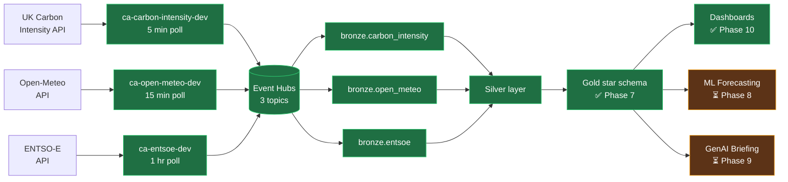

# GridSense

> Carbon-Aware Energy Grid Intelligence Lakehouse on Azure

A near-real-time data lakehouse that ingests electricity grid telemetry from 30+ European sources, computes live carbon intensity, forecasts the next 24 hours of grid cleanliness using machine learning, and generates carbon-aware workload scheduling recommendations through a GenAI agent.

## Stack

**Streaming ingestion** · **Medallion architecture** · **Spark Structured Streaming** · **MLflow forecasting** · **GenAI briefing agent** · **Databricks AI/BI dashboards**

## Architecture

See the **[Live status diagram](#live-status-as-built)** below for the as-built data flow.

- **Compute:** Azure Databricks (serverless job compute)
- **Streaming ingest:** Spark Structured Streaming (Kafka surface of Event Hubs)
- **Storage:** ADLS Gen2 + Delta Lake (bronze/silver/gold/quarantine schemas)
- **Governance:** Unity Catalog
- **Producers:** Python on Azure Container Apps (one per data source)
- **Secrets:** Azure Key Vault, surfaced via UAMI to Container Apps and via KV-backed secret scope to Databricks
- **IaC:** Terraform + Databricks Asset Bundles
- **CI/CD:** GitHub Actions (planned, Phase 11)
- **Monitoring:** Azure Monitor + Log Analytics

## Project status

🚧 Under active construction. Following the 12-phase implementation guide.

| Phase | Status |
|---|---|
| 1. Repository & local env | ✅ Done |
| 2. Azure foundation (Terraform) | ✅ Done |
| 3. Databricks workspace config | ✅ Done |
| 4. Data producers (Container Apps) | ✅ Done (3 producers live) |
| 5. Bronze layer streaming | ✅ Done (3 tables, hourly ingest) |
| 6. Silver layer (cleansing + joins) | ✅ Done (5 tables incl. grid_state 3-way join) |
| 7. Gold layer (star schema) | ✅ Done (4 dims + 2 facts; fact_grid_hourly deferred to 7.C) |
| 8. ML forecasting (MLflow) | ⚪ Not started |
| 9. GenAI briefing agent | ⚪ Not started |
| 10. Dashboards (Databricks AI/BI) | ✅ Done — 3 dashboards, see [docs/PHASE10.md](docs/PHASE10.md) |
| 11. CI/CD (GitHub Actions) | ⚪ Not started |
| 12. Monitoring & observability | ⚪ Not started |

## Live status (as-built)

Three producers publish to Azure Event Hubs; thirteen Databricks jobs cascade hourly (Bronze ingest → Silver parse+join → Gold star schema) into Delta tables in Unity Catalog. The Gold layer is a two-fact star schema: a fuel-mix fact at hourly grain across 6 countries, and a carbon-intensity fact at 30-min grain across 18 UK regions. All resources provisioned via Terraform, all Databricks code deployed via Asset Bundles.



### What's running right now

| Component | Cadence | Volume |
|---|---|---|
| `ca-carbon-intensity-dev` Container App | 5 min poll | ~5,184 msg/day |
| `ca-open-meteo-dev` Container App | 15 min poll | ~576 msg/day |
| `ca-entsoe-dev` Container App | 1 hr poll | ~120 msg/day |
| `bronze_carbon_intensity` Databricks Job | Hourly (cron `0 5 * * * ?`) | reads from `carbon-intensity` topic |
| `bronze_open_meteo` Databricks Job | Hourly (cron `0 10 * * * ?`) | reads from `open-meteo` topic |
| `bronze_entsoe` Databricks Job | Hourly (cron `0 15 * * * ?`) | reads from `entsoe` topic |
| `silver_carbon_intensity` Databricks Job | Hourly at :25 | parse + dedup + MERGE into `silver.carbon_intensity` |
| `silver_open_meteo` Databricks Job | Hourly at :30 | parse + dedup + MERGE into `silver.weather` |
| `silver_entsoe` Databricks Job | Hourly at :35 | parse + dedup + MERGE into `silver.generation` |
| `silver_country_dim` Databricks Job | Hourly at :40 | static 6-row country to capital mapping |
| `silver_grid_state` Databricks Job | Hourly at :45 | 4-way join into `silver.grid_state` (the interview-worthy artifact) |
| `gold_dim_country` Databricks Job | Hourly at :50 | static dim with EIC + timezone offsets |
| `gold_dim_fuel_type` Databricks Job | Hourly at :52 | unified fuel taxonomy + IPCC AR5 lifecycle carbon |
| `gold_dim_time` Databricks Job | Hourly at :55 | 17,521-row hourly dim (2026-2028 UTC) |
| `gold_fact_generation_fuel_hourly` Databricks Job | Hourly at :57 | star-schema fact: country x hour x fuel |
| `gold_dim_uk_region` Databricks Job | Hourly at :53 | static dim: 14 UK DNO regions + 4 national rollups |
| `gold_fact_carbon_intensity_30min` Databricks Job | Hourly at :59 | star-schema fact: UK region x 30-min interval (forecast + actual) |

### Architectural decisions worth flagging

- **Source-named topics, not domain-named.** `open-meteo` topic for the open-meteo producer (not `weather`). Schema and data domain live in the event envelope, not the topic name.
- **Producer-side: managed identity all the way.** Container Apps authenticate to Event Hubs via UAMI + OAuth bearer (no connection strings, no SAS keys, no secrets).
- **Consumer-side: Service Principal workaround.** Databricks Spark Kafka client does not natively support managed identity auth as of late 2025; SP + Key Vault is the documented Microsoft pattern. Switch to UC Service Credentials when DBR 16.1+ goes GA.
- **Secret-management via Azure Key Vault.** Single source of truth: ENTSO-E API token, Databricks SP credentials. Surfaced into Container Apps via the `secrets` block in Terraform and into Databricks via a KV-backed secret scope.
- **Shared Python package between producers.** `producers/_common/` is installed editable into each producer image at build time; carries the OAuth handler and event envelope code so producer-specific files stay small.
- **MERGE-with-dedup, not append-only, in Silver.** Producers publish each natural key many times (forecast then actual, retries, TSO corrections). Silver dedupes the source DataFrame via `ROW_NUMBER() OVER (PARTITION BY natural_key ORDER BY ingested_at DESC)` before MERGE; this both fixes Delta's `DELTA_MULTIPLE_SOURCE_ROW_MATCHING_TARGET_ROW_IN_MERGE` error and gives latest-wins semantics.
- **Unified fuel taxonomy across two upstream sources.** `gold.dim_fuel_type` maps ENTSO-E PsrType codes (B01–B25) and UK Carbon Intensity plain labels (`nuclear`, `solar`, `wind`...) to a single `fuel_key`, with `is_renewable`, `is_low_carbon`, and IPCC AR5 lifecycle `typical_gco2_per_kwh`. Downstream "renewable share for FR last hour" becomes one star join, not a `CASE WHEN` ladder.
- **Two facts at different grains, not one merged fact.** `fact_generation_fuel_hourly` (country × hour × fuel) and `fact_carbon_intensity_30min` (UK region × 30-min) answer complementary questions: lifecycle CO₂ from typical fuel-mix averages vs. live measured grid intensity. Merging them into one OBT would force a grain compromise; keeping them separate lets each be queried at its natural grain and joined when needed.

## Data sources

| Source | Type | Cadence | Purpose |
|---|---|---|---|
| UK Carbon Intensity API | REST, no key | 5 min poll | Live carbon intensity (forecast + actual) for 14 UK DNO regions |
| Open-Meteo Weather | REST, no key | 15 min poll | Wind speed, solar irradiance, temperature, cloud cover for 6 EU cities |
| ENTSO-E Transparency | REST, token (KV-backed) | 1 hr poll | Actual generation per production type for 6 EU bidding zones |
| OpenStreetMap power | Static extract | Once (Phase 7) | Power plant locations |

## Outcomes targeted

| Metric | Target |
|---|---|
| End-to-end latency (event → gold) | < 60 sec (p95) |
| Data quality (DLT expectations pass) | > 99% |
| Forecast accuracy (24h carbon intensity) | MAPE < 15% |
| GenAI briefing freshness | Daily, by 06:00 UTC |
| Monthly Azure cost | < ₹10,000 (~ $120) |

## Repo layout

```
gridsense/
├── .github/workflows/   # CI/CD pipelines
├── infra/               # Terraform (foundation, eventhubs, databricks, container-apps)
│   ├── envs/            # Per-environment composition (dev, staging, prod)
│   └── modules/         # Reusable Terraform modules
├── producers/           # Python ingestion services (one per data source)
├── databricks/          # Databricks Asset Bundle (notebooks, jobs, DLT pipelines, ML, GenAI)
├── powerbi/             # Semantic model + .pbix report
├── scripts/             # Operational scripts (deploy, seed catalog, etc.)
├── Makefile             # Daily-driver commands
└── README.md            # This file
```

## Daily commands

```bash
make help              # show all available targets
make fmt               # format Terraform + Python
make lint              # run all linters
make test              # run unit tests
make deploy-dev        # deploy infra + Databricks bundle to dev
make destroy-dev       # tear down dev (stops cost accrual)
make providers-check   # verify Azure resource providers are registered
make azure-whoami      # show current Azure CLI account
```

## Documentation

- [Architecture deep-dive](docs/architecture.md) — implementation log with per-phase design decisions, issues, and resolutions
- [Operational runbook](docs/runbook.md) — *(coming in Phase 12)*

## License

Personal portfolio project. Not for redistribution.
