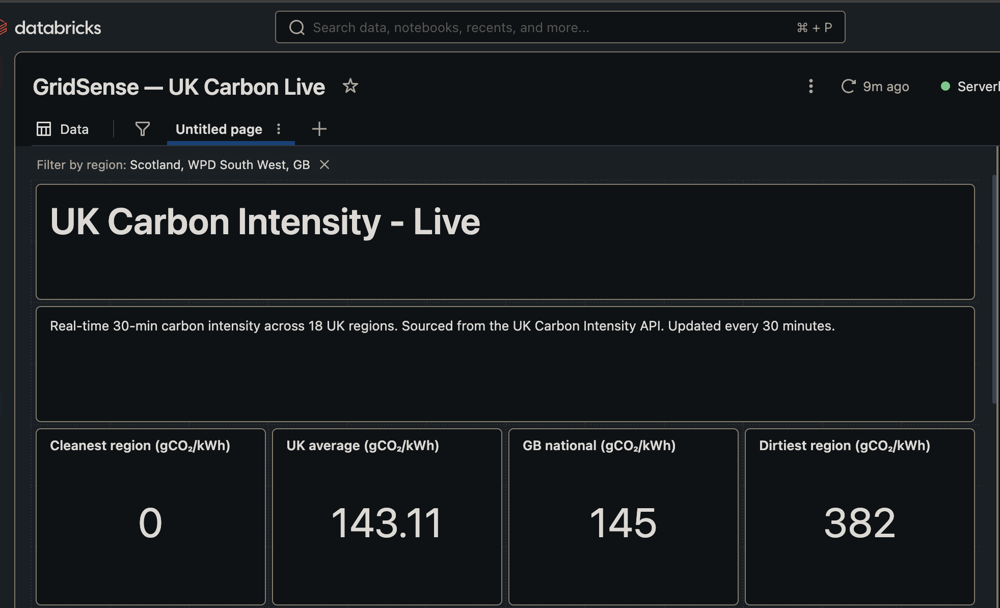
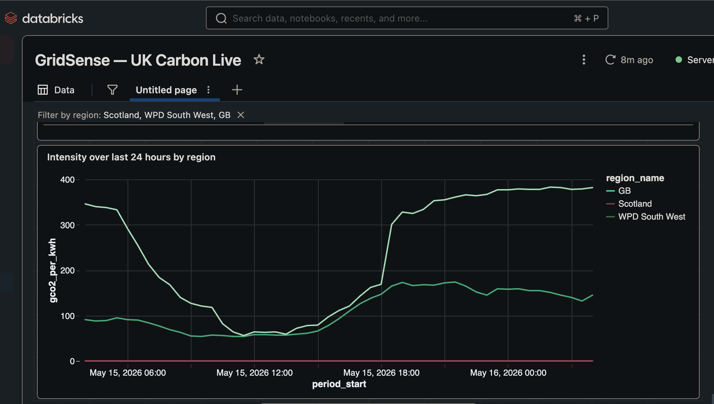
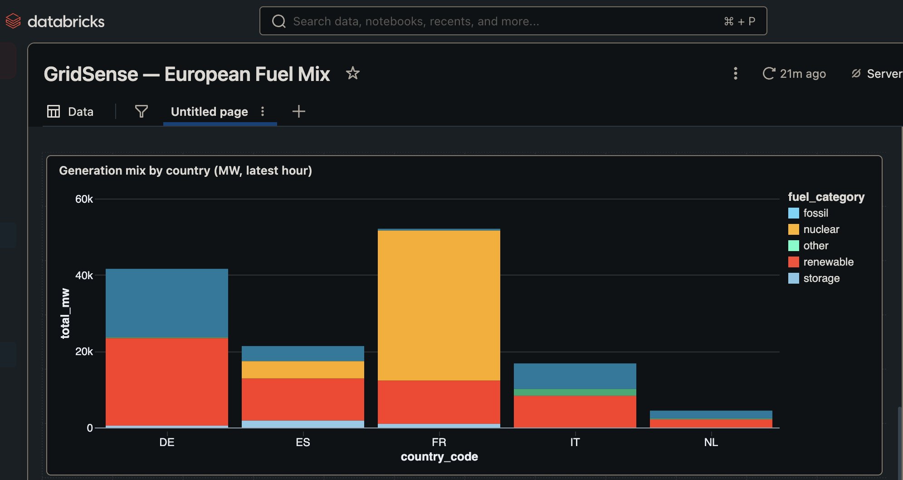
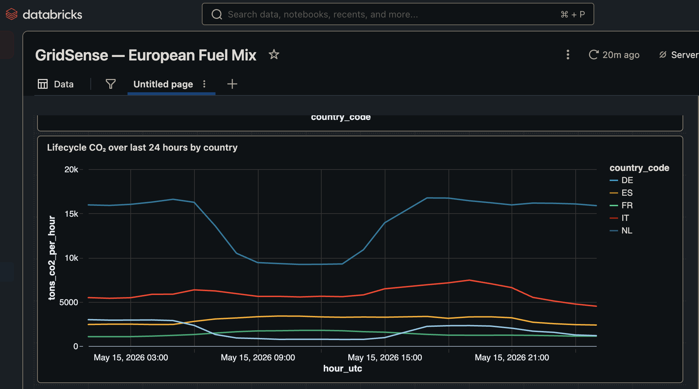
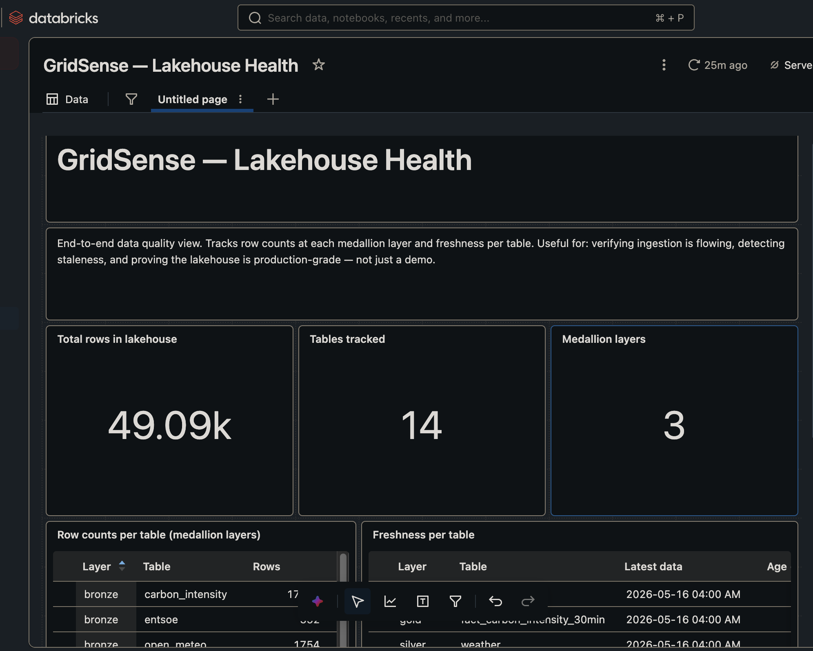
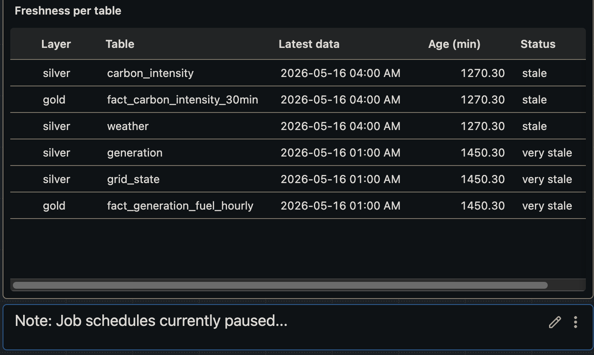

# Phase 10 — Dashboards & Data-Quality Observability

Three Databricks AI/BI Dashboards on top of the Gold star schema. Two analytic
dashboards tell the carbon story; a third tells the engineering story.

## Why Databricks AI/BI, not Power BI on Fabric DirectLake

The original plan was Power BI on Fabric DirectLake. Microsoft restricted the
Microsoft 365 Developer Program in 2025 to paid Visual Studio Pro/Enterprise,
MAICPP/ISV Success partners, and Premier/Unified Support customers. No free
path to a Fabric capacity for individual developers; a paid capacity at
₹50,000+/month would have contradicted the FinOps story this project is
trying to demonstrate.

Pivoted to native Databricks AI/BI. Trade-offs:

| Gained | Lost |
|---|---|
| Queries in Unity Catalog, audit follows the catalog | DirectLake's no-copy wow |
| No DAX, no semantic-model sync, no publish step | Power BI brand familiarity |
| Free with the existing workspace | The Fabric tenant story |
| Time to ship: pivoted same day | — |

## The three dashboards

| Dashboard | What it shows | Hero visual |
|---|---|---|
| **D1 — UK Carbon Live** | 18 UK regions, same minute, 0–382 gCO₂/kWh | 24h line chart filtered to 3 regions |
| **D2 — European Fuel Mix** | 6 EU countries, structural energy fingerprints | 24h CO₂ line (FR flat vs DE swing) |
| **D3 — Lakehouse Health** | row counts + freshness per medallion table | Freshness table + FinOps explainer |

### What each dashboard proves about carbon-aware compute

- **D1**: workload placement *inside* the UK still matters — Scotland 0 vs
  South West 382 gCO₂/kWh, same minute.
- **D2**: workload placement *between* countries matters far more — France
  ~1.1k tCO₂/hr vs Germany ~16k tCO₂/hr, same hour.
- **D3**: any claim above is only credible if the lakehouse is fresh and
  complete; D3 proves it — honestly, even when it isn't.

## Dashboard 1 — UK Carbon Live

### Datasets (`docs/sql/dashboards/d1_uk_carbon_live/`)

- `uk_latest_intensity.sql` — 18 rows, latest snapshot
- `uk_intensity_24h_timeseries.sql` — ~864 rows, last 24 hours
- `uk_kpis_latest.sql` — 1 row, cleanest/dirtiest/avg/GB national

### Widgets

1. Title + subtitle
2. 4 KPI counters
3. Ranking table (18 regions, sorted by intensity desc)
4. Multi-select region filter
5. 24h time-series line chart (filtered by widget 4)

### Screenshots

Headline strip: 0 / 143.11 / 145 / 382 gCO₂/kWh. The filter pill at top reads
"Filter by region: Scotland, WPD South West, GB" — confirms the filter is
wired to the line chart below.

The line chart with the filter narrowed to 3 strategic regions: Scotland
(flat at 0), WPD South West (peaks 380+), GB national (country average).
One visual proves the intra-country case.

## Dashboard 2 — European Fuel Mix

### Datasets (`docs/sql/dashboards/d2_european_fuel_mix/`)

- `eu_fuel_mix_latest_hour.sql` — ~20 rows (country × fuel_category)
- `eu_kpis_latest_hour.sql` — 1 row of headline metrics
- `eu_co2_24h_per_country.sql` — ~119 rows (country × hour over 24h)

### Widgets

1. Title + subtitle (mentions ENTSO-E ~3-4h publication lag)
2. 3 KPI counters
3. Country × fuel breakdown table (sorted by tCO₂/hour desc)
4. Stacked bar — generation mix by country
5. 24h CO₂ line chart by country — the hero visual

### Screenshots

Five vertical bars stacked by `fuel_category`. France dominated by nuclear
(orange) ~30 GW of carbon-flat baseload. Germany bigger overall but heavily
layered with fossil. Italy and Spain mid-sized. Netherlands small but
fossil-leaning.

The dashboard's hero chart. Germany (light blue) swings 16k → 9k → 16k tons/
hour through the day — a 40% intra-day trade. France (green) is essentially
a flat horizontal stripe at ~1.1k. Italy (red) second-highest with an evening
peak. Spain (yellow) and Netherlands (cyan) in between. *Country* is a far
stronger carbon lever than *time of day* for most workloads.

### Known issue — unit-bug workaround

The upstream `gold.fact_generation_fuel_hourly.estimated_gco2_per_hour` is
computed as `value_mw × typical_gco2_per_kwh` but should be
`value_mw × 1000 × typical_gco2_per_kwh`. All three D2 dataset SQL files
compensate with `× 1000`. Without the workaround, KPIs read 25 and 0.2 — off
by 1000×. With it, ~25,037 tons/hour and ~184 gCO₂/kWh, matching the
realistic EU power-sector profile. Source fix deferred to Phase 7.C.

## Dashboard 3 — Lakehouse Health

### Datasets (`docs/sql/dashboards/d3_lakehouse_health/`)

- `layer_row_counts.sql` — 14 rows, count per table
- `freshness_per_table.sql` — 6 rows, age + status per table
- `kpi_lakehouse_summary.sql` — 1 row of headline counts

### Widgets

1. Title + subtitle
2. 3 KPI counters (Total rows | Tables tracked | Medallion layers)
3. Row counts per table
4. Freshness per table
5. FinOps explainer text widget

### Screenshots

49.09k total rows · 14 tables · 3 medallion layers. Volume confirms the
pipeline has been running long enough to be substantive, not a toy.

Every row reads "stale" or "very stale". *Intentional* — the FinOps pause
keeps schedules off during the data-accumulation window. The note widget
below the table makes that explicit. Two cohorts visible (1270 vs 1450 min);
the 3-hour split is the ENTSO-E publication lag, made visible rather than
buried.

## Design choices worth defending

- **Three dashboards, not one.** Different grains (30-min UK, hourly EU,
  metadata) and different audiences. Mixing them forces grain compromises.
- **All datasets fully qualified `dbw_gridsense_dev.<schema>.<table>`.**
  Portable to the SQL Editor and external tools, no dependency on default-
  catalog settings.
- **Counter aggregation = None.** Avoids the misleading `SUM(cleanest_...)`
  label when the dataset already returns one aggregated row.
- **Filter cascade via shared dataset.** D1's region filter and line chart
  share `uk_intensity_24h_timeseries`; AI/BI cascades automatically with no
  explicit widget-to-widget binding.
- **Freshness measured against business timestamp, not ingested_at.** A row
  ingested 30 seconds ago that represents 23:00 yesterday is not fresh from
  a consumer's perspective.

## Follow-ups

1. **Phase 7.C — fix the unit bug** in
   `databricks/src/gold/fact_generation_fuel_hourly.py`. After the fix,
   remove `× 1000` from all three D2 dataset SQL files.
2. **Resume schedules before a live demo.** Unpause ~2 hours ahead so D3's
   freshness column turns green.
3. **Power BI mirror as a follow-up.** With a Fabric capacity later,
   replicate D1 in Power BI Desktop reading the same Unity Catalog tables.
   Side-by-side comparison would be a strong tool-trade-off talking point.
4. **Map widget for UK regions.** The CASE columns for approx_lat/lon are
   already in `uk_latest_intensity.sql`; map widget deferred for scope.
