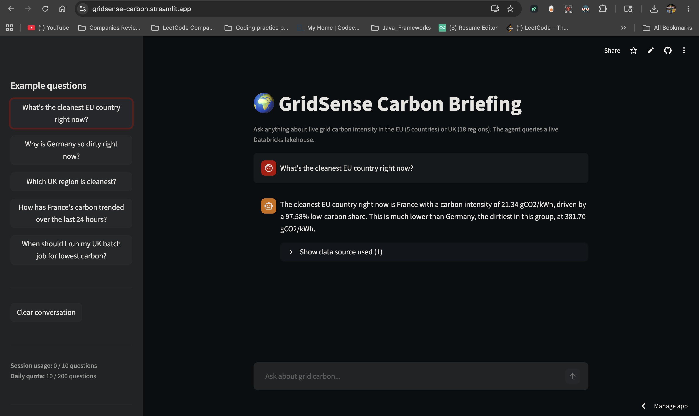
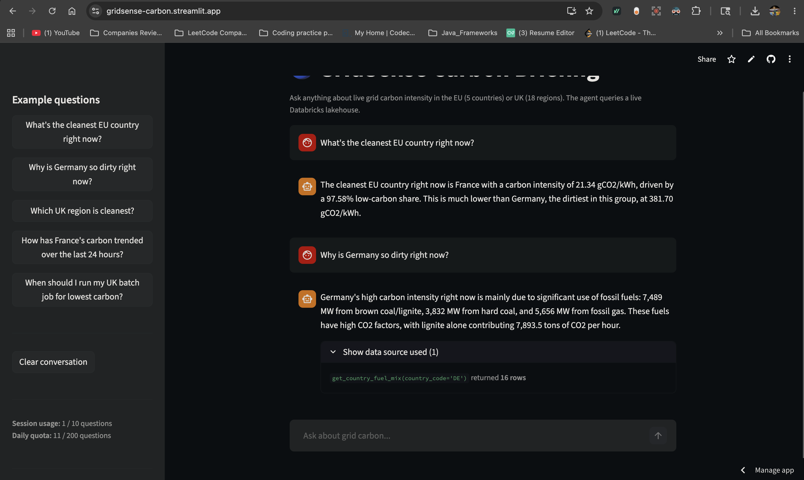

# Phase 9 — GenAI Carbon Briefing Agent

A Streamlit web app that answers natural-language questions about live EU and UK
grid carbon intensity. Five SQL-backed tools, each tied to one Gold-layer fact
table, exposed to `gpt-4.1-mini` via Azure OpenAI tool calling.

**Live demo:** [gridsense-carbon.streamlit.app](https://gridsense-carbon.streamlit.app)



## Why an agent on top of dashboards

Dashboards (Phase 10) answer *"show me the data."* The agent answers *"tell me
what the data means."* Different cognitive modes; both valuable. A recruiter
clicking the live URL doesn't need to learn a dashboard's filter widgets — they
ask a question and get a sourced answer.

The agent is also the first piece of the project that is **end-user facing**.
Bronze/Silver/Gold layers, CI/CD, FinOps — all infrastructure invisible to
anyone who isn't running the project. The chat URL is the first artifact a
recruiter actually interacts with.

## Why Azure OpenAI, not Anthropic Claude direct

For an Azure Data Engineer role, the agent's LLM should also be Azure-native.
Azure OpenAI is a first-class Azure service that shows up in JDs and pairs
naturally with the rest of the stack. Anthropic Claude API is technically
newer/more capable, but signals "I went outside the platform" — wrong message
for the role being targeted.

Azure OpenAI was provisioned in `swedencentral` (the rest of the project lives
in `centralindia`):

| Why a different region for OpenAI | |
|---|---|
| `centralindia` | No Azure OpenAI capacity available |
| `swedencentral` | EU-adjacent (data residency consistency with EU energy sources), full GPT-4.1-mini availability, low latency to Databricks workspace |

Cross-region API calls add ~50–100ms of latency, imperceptible for a chat agent
and free under the same subscription.

## Why GPT-4.1-mini, not GPT-4o-mini

Originally planned `gpt-4o-mini` version `2024-07-18`. Azure had deprecated that
version on `2026-03-31` — the deployment-create command rejected it. Switched to
`gpt-4.1-mini` (`2025-04-14`), `GlobalStandard` SKU.

The newer model is cheaper per token and has measurably better tool-calling
accuracy. Same model family Azure now defaults to for new deployments.

## Why Streamlit Cloud, not Azure Container Apps

The agent runs on Azure (OpenAI) and queries Azure (Databricks). The *UI*
hosting itself doesn't need to live on Azure to make the architecture coherent.
Streamlit Community Cloud is free, auto-deploys from GitHub on every push, and
the live URL is shorter and more memorable than an Azure-hosted equivalent
would be.

A previous version of this writeup considered Azure Container Apps. The tax
was about 30 extra minutes of setup for zero added value to the demo. Cut.

## Why five bounded tools, not one generic SQL tool

The naive design is "one tool that takes arbitrary SQL." It's flexible — and
also a hallucination factory and SQL-injection vector.

Bounded surface instead: five named tools, each hand-written with parameterised
SQL against one Gold fact. The LLM picks *which tool* to call and *what
parameters*, never what SQL string to write.

| Tool | Reads from | Answers |
|---|---|---|
| `get_eu_carbon_rankings` | `fact_grid_hourly` | "Cleanest EU country right now?" |
| `get_uk_regional_carbon` | `fact_carbon_intensity_30min` | "Cleanest UK region right now?" |
| `get_country_fuel_mix` | `fact_generation_fuel_hourly` | "Why is DE so dirty right now?" |
| `get_24h_carbon_trend` | `fact_grid_hourly` | "How has FR trended over 24h?" |
| `get_cleanest_window_uk` | `fact_carbon_intensity_30min` | "When to run my UK batch job?" |

When Phase 8 (ML forecasting) ships, the design extends naturally: register one
more tool that hits the forecast table. No agent redesign needed.

## Architecture

```
User question
    │
    ▼
Streamlit chat UI  (gridsense-carbon.streamlit.app)
    │
    ▼
gpt-4.1-mini  (Azure OpenAI, swedencentral)
    │  picks which tool(s) to call
    ▼
One of 5 SQL tools
    │
    ▼
Databricks SQL Warehouse  (Serverless, auto-resumes)
    │
    ▼
Tool result fed back to LLM
    │
    ▼
Natural-language answer with citations
```

## Tool-call transparency

Every answer includes a collapsed *"Show data source used (N)"* footer that, when
opened, lists the exact tool calls + parameters + row counts that produced the
answer.



This footer is the strongest single signal that the agent is grounded, not
fabricating. An interviewer reading "Germany burns 7,489 MW of lignite" can
expand the footer and see `get_country_fuel_mix(country_code='DE') returned
16 rows` — the exact query that produced that number, against the user's own
catalog. Anyone can wire a chatbot to GPT; few can demonstrate that the
chatbot is querying their lakehouse and surfacing the receipts.

## Cost protection: three layers

Posting the live URL on LinkedIn creates abuse exposure. A bot finding the
endpoint and hammering it at maximum rate, with no protections, could rack
up real money. Three layers were added before the URL went public.

### Layer 1 — Azure OpenAI deployment rate limit

Reduced from the default `10 req/min, 10k tokens/min` to `3 req/min, 3k tokens/min`
via the Foundry portal deployment editor. Hard server-side ceiling: at full
abuse, ~$50/month is the *worst-case theoretical* spend.

### Layer 2 — Azure budget alert

Monthly budget of $10 set on the `rg-gridsense-openai` resource group, with
email alerts at 50% / 80% / 100% thresholds. Cost Management doesn't auto-stop
spending, but the email arrives within hours of crossing the line.

### Layer 3 — In-app rate limiting

Two limits enforced in Streamlit:

- **Per-session limit:** 10 questions per browser tab (uses `st.session_state`)
- **Global daily limit:** 200 questions per day across all users (uses a
  JSON file in `/tmp` that persists across reruns within the Streamlit Cloud
  container)

The sidebar shows both counters in real time. When a limit is reached, the
agent doesn't deny silently — it shows a polite warning that redirects the
user to the GitHub repo:

> *"You've reached the demo limit of 10 questions for this session. Refresh
> the page to start a new session, or check out the GitHub repo to see the
> full project including code, architecture, and screenshots."*

### Combined worst case

At maximum abuse: 200 questions/day × ~1,700 tokens/question × ~$0.0004/question =
**~$2.40/month**. Realistic portfolio use: pennies.

## Honest-decline behavior is intentional

The fifth tool, `get_cleanest_window_uk`, filters the UK Carbon Intensity
forecast to periods `>= CURRENT_TIMESTAMP()`. Right now, the producer schedules
are paused (FinOps), so there are no future periods in the table.

When asked "when should I run my UK batch job for lowest carbon?", the agent
calls the tool, gets 0 rows back, and answers honestly:

> *"The data for the cleanest upcoming 30-minute slots in the UK is not yet
> available right now, so I can't provide the best time to run your batch
> job for lowest carbon at the moment."*

The temptation was to soften the SQL filter to "last 24h relative to MAX(period_start)"
so the agent always returns something. Rejected. The honest decline is a
stronger interview signal than a patched-but-misleading answer: it
demonstrates the agent respects data freshness and reports gaps instead of
fabricating recommendations.

When producer schedules are unpaused, the current query becomes correct
automatically — no agent code change needed.

## What this does NOT do (deliberately)

- **No ML forecasts** — Phase 8 hasn't shipped (training table needs ~2 weeks
  of accumulated data). When it does, register one more tool that queries the
  forecast table.
- **No write operations to the lakehouse** — read-only by design. No
  `INSERT`/`UPDATE`/`DELETE` paths from the agent.
- **No persistent memory across sessions** — refreshing the page resets the
  conversation. Portfolio demos don't need cross-session memory; production
  agents would.
- **No multi-region routing** — single Azure OpenAI deployment is fine for
  portfolio scale.

## Verification — all 5 tools tested before public deploy

| Test | Result |
|---|---|
| `get_eu_carbon_rankings` | FR at 21.34 gCO₂/kWh, 97.58% low-carbon — matches `fact_grid_hourly` |
| `get_country_fuel_mix(DE)` | Lignite 7,489 MW + hard coal 3,832 MW — biomass nuance surfaces |
| `get_uk_regional_carbon` | North Scotland (SSEN) + SP Distribution tied at 0 gCO₂/kWh |
| `get_24h_carbon_trend(FR)` | 20.22–27.25 gCO₂/kWh range, time-of-day pattern visible |
| `get_cleanest_window_uk` | Correctly declines (producers paused, no future data) |
| Off-topic question ("explain this project") | Declines, redirects to in-scope topics |
| Multi-tool orchestration ("which country has more nuclear production?") | 5 parallel `get_country_fuel_mix` calls, then ranked answer |

## Files

| Path | Purpose |
|---|---|
| `streamlit_app/app.py` | Streamlit UI + chat loop |
| `streamlit_app/agent/llm.py` | Azure OpenAI client + iterative tool-call loop |
| `streamlit_app/agent/tools.py` | 5 SQL-backed tools + OpenAI tool schemas |
| `streamlit_app/agent/prompts.py` | System prompt with domain facts + decline guidance |
| `streamlit_app/agent/rate_limit.py` | Per-session + global daily rate limits |
| `streamlit_app/requirements.txt` | streamlit, openai, databricks-sql-connector, pandas |
| `streamlit_app/.streamlit/secrets.toml.example` | Template; real one gitignored |
| `streamlit_app/README.md` | Local-run + deploy instructions |

## Commits in this phase

```
c0d85e8  feat(agent): Phase 9 — GenAI carbon briefing agent (Azure OpenAI + Databricks SQL)
347420d  feat(agent): Phase 9 cost protection — per-session + global daily rate limits
9ce05fa  fix(agent): make tool-call footer subtler — clearer label + caption styling
```
