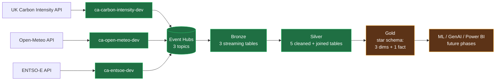

# GridSense Architecture

> A near-real-time data lakehouse on Azure that ingests European electricity-grid telemetry, computes carbon intensity, and produces analytical artifacts ready for ML forecasting and GenAI briefings.

This document is the implementation log: what was built, why those choices, what broke, and how it was resolved. It complements the [README](../README.md) (which is the entry point) and the commit log (which is the change history).

---

## 1. System overview

Three Python producers running on Azure Container Apps poll three independent electricity-grid APIs and publish events to Azure Event Hubs. From there, eleven Databricks jobs cascade hourly through a medallion architecture (Bronze → Silver → Gold) into Delta Lake tables governed by Unity Catalog.



Cadences and ownership:

| Layer | Components | Schedule |
|---|---|---|
| Producers | 3 Container Apps | Continuous (5-min, 15-min, 1-hr polls) |
| Bronze | 3 Databricks streaming jobs | Hourly at :05, :10, :15 |
| Silver per-source | 3 Databricks jobs | Hourly at :25, :30, :35 |
| Silver dim + join | 2 Databricks jobs | Hourly at :40, :45 |
| Gold dims + fact | 4 Databricks jobs | Hourly at :50, :52, :55, :57 |

Total: 3 producers + 11 Databricks jobs running 24/7, fully provisioned via Terraform and Databricks Asset Bundles.

---

## 2. Design principles

The choices below are not platitudes — each one resolved a real tension during build.

### 2.1 Medallion architecture with hard boundaries
- **Bronze:** raw envelopes, append-only, never edited. If a downstream layer is wrong, Bronze is the source of truth to rebuild from.
- **Silver:** parsed, typed, deduplicated, validated. The first layer where data is "trustable" for analytics.
- **Gold:** star schema. Analytics-ready. Surrogate keys, denormalized for query performance, lifecycle-carbon enrichment.

Each layer reads only from the layer immediately below it. No Bronze → Gold leaps.

### 2.2 Source-named topics, not domain-named
Event Hubs topic names match the producer (`open-meteo`, `entsoe`, `carbon-intensity`), not the data domain (`weather`, `generation`, `carbon`). Multiple weather providers? Each gets its own topic. The schema and data domain live in the event envelope, not the topic name.

### 2.3 Managed identity for producers, Service Principal for consumers
- **Producer-side:** Azure Container Apps use a user-assigned managed identity (UAMI) that has `Azure Event Hubs Data Sender` on the namespace. Zero secrets in the producer code.
- **Consumer-side:** Databricks Spark Kafka client does not natively support managed-identity auth (as of late 2025). The Microsoft-documented workaround is a Service Principal with client secret stored in Azure Key Vault, surfaced into Databricks via a KV-backed secret scope. This is documented as a known migration target when Unity Catalog Service Credentials for Kafka go GA.

### 2.4 Centralized secret management via Azure Key Vault
One Key Vault holds every secret: ENTSO-E API token, Databricks SP credentials. Producers reach KV via UAMI; Databricks reaches it via a KV-backed secret scope. No connection strings, no SAS keys, no `.env` files in the repo.

### 2.5 Explicit schemas everywhere
- `from_json` with declared `StructType` schemas, not inference. Catches upstream drift early, keeps Spark plans stable.
- Explicit DataFrame aliases on every join. Spark Connect (serverless) rejects ambiguous column references that classic Spark would tolerate.
- Explicit timestamp formats. Each of the three APIs emits timestamps differently; default parsers silently produce NULLs on edge cases.

### 2.6 MERGE-with-dedup, not append-only, in Silver
Producers publish each natural key multiple times (forecast → actual republished, retries, TSO corrections). Bronze is append-only and accumulates these duplicates. Silver dedupes the source DataFrame via a `ROW_NUMBER()` window function over `(natural_key, ingested_at DESC)` keeping `rn=1` *before* the MERGE. Without this, Delta raises `DELTA_MULTIPLE_SOURCE_ROW_MATCHING_TARGET_ROW_IN_MERGE`. With this, MERGE gives latest-wins semantics for free.

### 2.7 Quarantine, not crash, on bad data
Malformed envelopes never break the pipeline. Each Silver job validates required fields and writes invalid rows to `quarantine.<source>` with a `reject_reason` column. The quarantine schema is an immutable audit log: each rejection instance gets its own row even if the same payload is rejected twice. Valid rows continue into `silver.<source>`.

### 2.8 Asset Bundles for Databricks, Terraform for infrastructure
Two IaC tools, clear boundaries:
- **Terraform** owns Azure resources: resource group, storage, Event Hubs, Container Apps, Databricks workspace, Key Vault, role assignments.
- **Asset Bundles** own Databricks artifacts: notebooks, jobs, schedules.

This avoids the "everything in Terraform" trap (Databricks resources are slow to manage there) and the "everything in Asset Bundles" trap (no support for Azure-level resources).

---

## 3. Per-phase implementation log

Phases 2 and 3 (Azure foundation, Databricks workspace setup) are documented in their respective commit messages on `main` and are not duplicated here. The log below covers phases 4–7 in depth.

### Phase 4 — Producers (Container Apps)

**What was built**

Three Python services, one per data source, packaged as Docker images and deployed to Azure Container Apps:
- `producers/carbon-intensity/` — polls UK Carbon Intensity API (no auth), 14 DNO regions, 5-minute cadence
- `producers/open-meteo/` — polls Open-Meteo (no auth), 6 EU cities, 15-minute cadence
- `producers/entsoe/` — polls ENTSO-E Transparency Platform (token auth), 6 EU bidding zones, 1-hour cadence

Each producer:
1. Auths to Event Hubs via UAMI + OAuth bearer token
2. Polls its upstream API
3. Wraps each event in a versioned envelope (`event_id`, `source`, `source_version`, `ingested_at`, `event_time`, `region`, `payload`, `checksum`)
4. Publishes to its source-named topic

Shared concerns live in `producers/_common/` (auth handler, envelope construction), installed editable into each image at build time.

**Key design decisions**

- *Source-named topics, not domain-named.* See §2.2. Reified during this phase when an early draft had `weather` as a topic name; renamed to `open-meteo` to align with the producer.
- *Envelope versioning baked into v1.* `source_version` is on every event from day one. The cost of adding it now is zero; the cost of adding it later is a schema migration across millions of events.
- *Terraform `for_each` over a producers map.* Each new producer is a new map entry; no copy-paste of Terraform resources. Phase 4.H (Open-Meteo) and 4.I (ENTSO-E) were each ~30 lines of additions to the map, not 200 lines of new resources.

**Issues hit and resolutions**

1. **Open-Meteo producer always emitted UTC midnight.** Caught much later during Phase 6.A development when `silver.weather` showed only 12 rows total across 6 cities and 24 hours. Root cause: `first_hour_snapshot()` took `times[0]` from the API response, which under `forecast_days=1` is today's UTC midnight regardless of poll time. Fix: pick the index whose timestamp matches the current UTC hour, with fallback to the latest index ≤ now. Rebuilt as image v2, rolled out via Terraform tag bump. Test updated for new latest-index-wins semantics.

2. **ENTSO-E averaging vs summing.** The A75/A16 query returns 15-minute resolution (PT15M) points within hourly TimeSeries. Initial code summed all points within a TimeSeries, producing 4× the true value. Fix: average within TimeSeries.

3. **ENTSO-E PsrType codelist was outdated.** Missing B21-B25. Producer was dropping those fuel types silently. Fix: extended PsrType codelist to all 28 entries (B01-B25 + A03-A05).

4. **Promoted Container Apps from imperative to declarative.** Initial deployment used `az containerapp create` (imperative). Promoted to Terraform `for_each` over producers map with `terraform import` to absorb the existing carbon-intensity app without recreation.

### Phase 5 — Bronze layer (streaming ingestion)

**What was built**

Three Spark Structured Streaming jobs reading from Event Hubs Kafka surface, writing to Delta tables partitioned by `event_date`, with checkpoints on ADLS for exactly-once semantics:
- `bronze.carbon_intensity` ← topic `carbon-intensity`
- `bronze.open_meteo` ← topic `open-meteo`
- `bronze.entsoe` ← topic `entsoe`

Each Bronze job is `availableNow=True` triggered (batch-on-schedule, not continuous streaming), runs hourly via Databricks Asset Bundle job schedules.

**Key design decisions**

- *availableNow trigger.* For hourly cadence with cheap recovery on failure, batch-on-schedule beats continuous streaming. Lower cost, simpler reasoning, same end-state.
- *Envelope preserved as JSON string.* Bronze does not parse the envelope. The envelope_json column carries the raw producer output untouched. Parsing happens in Silver. Bronze stays append-only and reversible.
- *Partition by event_date.* One file per day per topic. Cheap pruning for date-range queries; small enough to avoid the small-files problem.

**Issues hit and resolutions**

1. **Databricks does not natively support cluster managed-identity Kafka auth.** First job run failed with `Failed to create new KafkaAdminClient`. Researched: as of late 2025, Spark Kafka client in Databricks does not pick up the cluster's managed identity for OAuth. The Microsoft-documented workaround is a Service Principal with client secret in Key Vault, surfaced via KV-backed Databricks secret scope. Implemented:
   - New Azure AD application + Service Principal via Terraform `azuread` provider
   - SP granted `Azure Event Hubs Data Receiver` on the namespace
   - 1-year client secret + client_id + tenant_id stored as 3 KV secrets
   - Manual one-off (documented as runbook): granted the first-party AzureDatabricks SP `Key Vault Secrets User` on the vault so the workspace can read the KV-backed scope
   - KV-backed scope `gridsense-kv` created via Databricks UI
   - common.py rewritten to fetch SP credentials via `dbutils.secrets.get` and build the OAUTHBEARER JAAS config
   - Documented as a migration target: when Unity Catalog Service Credentials for Kafka go GA (DBR 16.1+), the SP can be retired in favor of the existing Databricks Access Connector UAMI.

2. **common.py missing `# Databricks notebook source` header.** `%run ./common` from the per-topic notebooks resolved to "notebook not found" because Databricks did not register common.py as a notebook without the header. Fix: added the magic header line at the top.

### Phase 6 — Silver layer (cleansing + joins)

**What was built**

Phase 6 split into two sub-phases:

*6.A — Three per-source Silver tables:*
- `silver.carbon_intensity` ← parse + dedup + validate `bronze.carbon_intensity`
- `silver.weather` ← parse + dedup + validate `bronze.open_meteo`
- `silver.generation` ← parse + dedup + validate `bronze.entsoe`

Each reads Bronze in batch (not streaming — MERGE semantics need batch), parses the envelope JSON with explicit `StructType` schemas, validates required fields, then either MERGEs into Silver on the natural key OR appends to `quarantine.<source>` with a `reject_reason`. Same dedup-before-MERGE primitive across all three, defined once in `databricks/src/silver/common.py`.

*6.B — Three-way join:*
- `silver.country_dim` — static 6-row mapping (country_code → capital_city), used as the bridge between weather (city grain) and generation (country grain)
- `silver.grid_state` — the integration artifact. 4-way LEFT JOIN from `silver.generation` (the spine, since it covers all 6 countries continuously) to `silver.country_dim`, then to `silver.weather` (via capital_city), then to a GB-only aggregated subquery from `silver.carbon_intensity`. Output at `(country_code, hour_utc)` grain.

**Key design decisions**

- *generation as the spine, LEFT joins for the rest.* Generation is the only source covering all 6 EU countries hourly. Weather is nullable when the producer has not yet published the matching hour. UK carbon intensity is GB-only by design — the regional API has no continental equivalent. Modeling these as LEFT joins makes the gaps explicit and analytically queryable rather than silently dropping rows.
- *30-min → hourly aggregation for UK carbon intensity.* UK Carbon Intensity publishes 30-minute settlement periods. We aggregate to hourly by `date_trunc('hour', period_start) + AVG(intensity_forecast)` so the grain matches generation's hourly grain.
- *Quarantine schema as immutable audit log.* Bad rows go into `quarantine.<source>` with `reject_reason` and `reject_at_ts`. No MERGE, no overwrite — each rejection is its own row. Bronze stays untouched; Silver stays clean; rejections stay auditable.

**Issues hit and resolutions**

1. **Delta MERGE failed with `DELTA_MULTIPLE_SOURCE_ROW_MATCHING_TARGET_ROW_IN_MERGE` on second run.** First run created the table via append (table didn't exist), wrote 7038 rows (the full Bronze count with all duplicates). Second run hit MERGE, found multiple source rows per natural key, refused to proceed. Root cause: Bronze accumulates all retries/republishes; many rows per natural key. Fix: dedupe the source DataFrame *before* MERGE via `ROW_NUMBER() OVER (PARTITION BY natural_key ORDER BY ingested_at DESC)` keeping `rn=1`. Now in `common.py.merge_into_silver`, used by all Silver jobs and reused unchanged in Gold. Latest-wins semantics fall out for free.

2. **Open-Meteo producer always emitted UTC midnight (cross-referenced from Phase 4).** First detected here when `silver.weather` had only 12 distinct rows across 24 hours × 6 cities. Confirmed via raw Bronze SQL showing each `(city, payload.time)` pair had ~85 rows for one single timestamp per UTC day. Fix is in the producer (Phase 4); Silver was correct.

3. **Serverless compute rejects `.cache()` / `.persist()`.** Initial `common.py` cached the parsed DataFrame to avoid re-computing it for `count()`, `valid.count()`, `invalid.count()`. Serverless threw `[NOT_SUPPORTED_WITH_SERVERLESS] PERSIST TABLE is not supported on serverless compute`. Fix: removed the `.cache()` call. On the data volumes involved (~7000 rows), re-computation is cheap and Spark caches blocks transparently.

4. **Spark's default `to_timestamp` rejects timestamps without seconds.** Open-Meteo emits `2026-05-14T00:00` (no seconds, no timezone). The producer's documented intent is UTC. Initial Silver appended `+00:00` to make `2026-05-14T00:00+00:00`, which Spark *still* rejected because the parser requires `:ss`. Fix: append `:00+00:00` so the resulting string `2026-05-14T00:00:00+00:00` is parser-friendly.

5. **Carbon Intensity API has no `intensity.actual` for the regional endpoint.** Schema initially declared `intensity_actual` as a nullable column expecting eventual population. Quickly discovered the regional API publishes forecasts only; actuals only come from the *national* `/intensity` endpoint. Decision: keep `intensity_actual` as a documented-nullable column rather than dropping it. Removing now means a backwards-incompatible schema change if we add the national endpoint in Phase 7+.

6. **Spark Connect rejects ambiguous column references that classic Spark tolerates.** First `silver.grid_state` run failed with `AMBIGUOUS_REFERENCE` on `capital_city`, which exists on both `country_dim` and `weather` after the join. Classic Spark would have warned; Spark Connect refused. Fix: alias every source DataFrame (`g`, `d`, `w`, `c`) and prefix every column reference throughout the join. This pattern is now reused in every multi-source join across Silver and Gold.

### Phase 7 — Gold layer (star schema)

**What was built (7.A)**

Phase 7.A shipped three dimensions and one fact table:

- `gold.dim_country` (6 rows, static) — extends `silver.country_dim` with EIC bidding-zone codes, ISO alpha-3 codes, and winter/summer timezone offsets
- `gold.dim_fuel_type` (29 rows, static) — unifies ENTSO-E PsrType codes (`B01`-`B25`) and UK Carbon Intensity plain labels (`nuclear`, `solar`, `wind`...) into a single `fuel_key`, with `is_renewable`, `is_low_carbon`, and IPCC AR5 lifecycle `typical_gco2_per_kwh`
- `gold.dim_time` (17,521 rows, generated) — hourly grain, 2026-01-01 to 2028-01-01 UTC. Carries year/quarter/month/week/day/hour numerics, `is_weekend`, `is_business_hour_uk`, `is_daytime_approx`, and a `yyyyMMddHH` integer `time_key` for cheap fact joins
- `gold.fact_generation_fuel_hourly` (2,070 rows at Phase 7.B close, growing hourly) — explodes `silver.generation.generation_mix` into one row per (country, hour, fuel). Joins to all 3 dims via surrogate keys. Computes `estimated_gco2_per_hour = value_mw × typical_gco2_per_kwh`

**What was built (7.B)**

Phase 7.B was originally scoped as `fact_grid_hourly` (a wide fact joining weather and generation). On opening 7.B, a Silver-table inspection showed that `silver.carbon_intensity` had been quietly accumulating ~2,000 rich rows across 18 UK regions at 30-min grain — measurably more demoable than a wide fact built on still-sparse weather. The scope pivoted accordingly. `fact_grid_hourly` slides to a later phase when weather density justifies it.

7.B shipped one dimension and one fact:

- `gold.dim_uk_region` (18 rows, static) — 14 GB DNO regions plus 4 national rollups (England, Scotland, Wales, GB) from the UK Carbon Intensity API. Carries `region_type` ("DNO" vs "national") and approximate lat/lon for Phase 10 Power BI maps. Rolls up to `dim_country` via `country_code = "GB"`.
- `gold.fact_carbon_intensity_30min` (2,070 rows at close) — UK carbon intensity at 30-min settlement-period grain. One row per (region_id, period_start). Carries `intensity_forecast` (always populated), `intensity_actual` (nullable; backfilled in a later phase), `source_type` discriminator, pre-computed `forecast_minus_actual` for Phase 8 model evaluation, and a denormalized `generation_mix` array.

**Pending (7.C — later phase)**

`gold.fact_grid_hourly` — wide fact from `silver.grid_state`, one row per (country, hour). Deferred until Open-Meteo weather data accumulates ~7 days of density across all 6 countries.

**Key design decisions**

- *Unified fuel taxonomy in `dim_fuel_type` is the payoff dim.* Without it, "what was the renewable share for FR last hour?" is a `CASE WHEN` ladder over PsrType strings. With it, that question is a one-line `WHERE is_renewable = true` filter. This is the dim that makes the rest of the schema worth its weight.
- *IPCC AR5 lifecycle carbon estimates as a static column.* `typical_gco2_per_kwh` is a hand-curated column sourced from IPCC AR5 WG3 Annex III (lifecycle medians: coal 820, gas 490, nuclear 12, solar 48, wind 11 gCO2-eq/kWh). It complements live grid carbon intensity from `silver.carbon_intensity` (which captures actual mix at a moment) by enabling "what's the typical emission profile of this country's fuel mix" without needing live carbon data for non-UK countries.
- *Two facts at different grains, not one merged fact.* `fact_generation_fuel_hourly` (country × hour × fuel, lifecycle CO₂) and `fact_carbon_intensity_30min` (UK region × 30-min, measured CO₂) answer complementary questions. Merging them into one OBT would force a grain compromise; keeping them separate lets each be queried at its natural grain and joined when needed.
- *Separate `dim_uk_region` rather than extending `dim_country`.* UK carbon intensity publishes per-DNO-region (London at 18:00 can be 189 gCO₂/kWh while South Scotland is 0) — a granularity `dim_country` cannot represent without breaking the one-row-per-country invariant. `dim_uk_region` joins to `dim_country` via `country_code` so country-level rollup still works in a single hop.
- *Inner join to dimensions, not left.* If an upstream PsrType or `region_id` is missing from its dim, that's a real data-quality issue we want to FAIL LOUDLY. A LEFT join with NULL would silently produce broken rows.
- *`source_type` discriminator instead of separate forecast/actual tables.* The UK API emits each period twice — first as forecast (`intensity_actual = null`), later as actual. One fact with a `source_type` column ("forecast" | "actual") and a pre-computed `forecast_minus_actual` measure means Phase 8's ML model can evaluate forecast accuracy without a join. Two tables would have required UNION-or-join logic everywhere downstream.
- *`time_key` deliberately hourly even for the 30-min fact.* `fact_carbon_intensity_30min` has two rows per `time_key`, distinguished by a `half_hour` column (0 or 30). `GROUP BY time_key` becomes the natural hourly rollup for BI; the denormalized `period_start` timestamp on the fact handles direct 30-min queries without a time-dim join. Avoids maintaining a parallel `dim_time_15min` that would duplicate 95% of `dim_time`'s columns.
- *`dim_time` sized to actual data window + 20-month forward.* Not 10 years. Larger ranges send a misleading signal about data availability. 2026-01-01 to 2028-01-01 honestly reflects: a few months before producers came online, 20 months of forward horizon for ML.

**Issues hit and resolutions**

Phase 7.A shipped with zero bugs. Phase 7.B shipped with zero bugs in the build itself. The patterns established in Silver (alias DataFrames, dedup before MERGE, common.py helpers) composed cleanly into Gold without modification. This is the strongest evidence in the project that the architecture is paying off.

Two judgment calls during 7.B worth recording, neither a bug:

1. *Initial ad-hoc table creation in the wrong workspace abstraction.* The 7.B dim and fact were first created via the SQL editor with unqualified table names (`gold.dim_uk_region` instead of `${catalog}.gold.dim_uk_region`). They happened to land in the right catalog because `dbw_gridsense_dev` is the workspace default, but this is fragile across targets. Resolution: dropped the SQL-editor tables, rebuilt via the Asset Bundle with the standard catalog-widget pattern matching every other Gold notebook. The bundle is now the single source of truth.
2. *Mid-phase scope pivot.* Started 7.B intending to build `fact_grid_hourly`; switched to `fact_carbon_intensity_30min` after `SHOW TABLES IN silver` revealed `silver.carbon_intensity` had richer ready-to-use data. The pivot cost ~30 minutes of design re-thinking and produced a substantially stronger demo (the UK regional intensity spread — South Wales at 365 gCO₂/kWh while Scotland sits at 0 — is the single most striking query result in the project so far). Recorded here because portfolio-honesty matters: shipping the right thing late is better than shipping the planned thing on schedule.

---
## 4. Cross-cutting concerns

### 4.1 Authentication architecture

Two distinct identity paths because of a Databricks limitation discussed in section 2.3:

| Identity | Used by | Granted | How |
|---|---|---|---|
| uami-gridsense-producers-dev (UAMI) | 3 Container Apps | Azure Event Hubs Data Sender on namespace | Producer code calls DefaultAzureCredential; IMDS returns a token |
| sp-gridsense-databricks-eh-dev (SP) | Databricks Spark Kafka client | Azure Event Hubs Data Receiver on namespace | Spark JAAS config reads SP credentials from dbutils.secrets.get |
| Databricks Access Connector UAMI | Unity Catalog to ADLS | Storage Blob Data Contributor on storage account | Unity Catalog external locations |
| AzureDatabricks first-party SP | Databricks workspace to Key Vault | Key Vault Secrets User on KV | KV-backed secret scope |

The producer-side UAMI also has Key Vault Secrets User for fetching the ENTSO-E API token. One identity, two responsibilities.

### 4.2 Secret management

One Key Vault (kv-gridsense-dev-dx0kcg) holds every secret. Two consumption paths:

| Consumer | Mechanism |
|---|---|
| Container Apps | Terraform-declared secrets block on Container App, mounted as environment variables via UAMI |
| Databricks notebooks | KV-backed secret scope gridsense-kv; dbutils.secrets.get(scope, key) |

Secrets in KV today:

- entsoe-api-token for the ENTSO-E producer
- databricks-eh-sp-client-id, databricks-eh-sp-secret, databricks-eh-sp-tenant-id for the Databricks Kafka auth path

Zero secrets in the repo. Zero connection strings. Zero .env files in version control.

### 4.3 Job orchestration cadence

All Databricks jobs run hourly on staggered cron schedules so each layer reads fresh upstream data. Bronze runs at :05/:10/:15, Silver per-source at :25/:30/:35, Silver dim+join at :40/:45, and Gold dims+fact at :50/:52/:55/:57.

Stagger of 20 min between Bronze and Silver, 5 min between Silver and Gold. Empirically, every job finishes in under 90 seconds, so there is substantial slack between layers; a long Bronze run cannot delay its corresponding Silver run.

If any job fails, the next hourly attempt picks up where the previous left off (MERGE-on-natural-key is idempotent). No backfill orchestration needed; the design absorbs single-run failures naturally.

### 4.4 Schema design conventions

- Natural keys explicit on every table. Bronze: implicit per-event. Silver: (region, period_start) / (city, time_utc) / (country, period_start). Gold facts: (country, hour_utc, fuel_key). Documented in each notebook's docstring.
- Surrogate keys in Gold facts only. time_key is yyyyMMddHH as BIGINT for cheap fact joins. country_key and fuel_key are string natural keys reused from the dims; surrogate integer keys would add no value for 6-row and 29-row dims.
- Timestamps stored as TIMESTAMP in UTC. Producer-side emits ISO strings with explicit offsets where the upstream API supports it. Silver casts to TIMESTAMP with explicit format strings, never default parsers.
- Generation mix as ARRAY of STRUCT in Silver, exploded in Gold. Silver preserves the upstream nested shape for traceability; Gold flattens it for analytical queries.

### 4.5 IaC discipline

| Layer | Tool | Lives in |
|---|---|---|
| Azure resources (RG, storage, EH, KV, ACA, Databricks workspace, role assignments, Azure AD apps) | Terraform | infra/envs/dev/, infra/modules/ |
| Databricks artifacts (notebooks, jobs, schedules, secret scope hookups) | Databricks Asset Bundles | databricks/databricks.yml, databricks/resources/, databricks/src/ |
| Manual one-offs (KV-backed secret scope creation, AzureDatabricks first-party SP role grant) | Documented runbook | _local_notes.md |

Pre-commit hooks (ruff, ruff-format, terraform fmt, terraform validate, secret detection, large file detection, YAML/JSON/TOML lint) run on every commit. The workflow is git add then git commit (hooks may auto-fix) then git add -A then git commit again. This catches drift before it lands on origin.

---

## 5. Known gaps and next phases

### 5.1 Current architectural gaps

- **GB has no rows in silver.generation.** ENTSO-E consistently returns no_data for GB on the A75/A16 endpoint we query. This means silver.grid_state and gold.fact_generation_fuel_hourly only cover 5 of the 6 countries (DE/ES/FR/IT/NL). UK Carbon Intensity gives GB-specific carbon data but no GB generation mix, so the asymmetry shows up as uk_carbon_intensity_forecast IS NOT NULL AND country_code = 'GB' being an empty set in silver.grid_state. Workarounds for a future phase: use an alternative GB generation source (BMRS), or model GB as a separate carbon-only fact.

- **Weather sparseness pending v2 producer accumulation.** The Open-Meteo v2 producer (current-hour fix) deployed mid-session. As of writing, silver.weather has roughly 18 distinct hours; will reach full density within 24 hours.

- **Quarantine tables are zero rows today.** Every Silver job validates and routes invalid rows to quarantine.source, but upstream data has been clean enough that nothing has been rejected yet. This is good (data is clean) but means the quarantine path is unexercised. A defensive test injecting a known-bad event would prove the path end-to-end; not yet done.

- **intensity_actual always NULL in silver.carbon_intensity.** The regional Carbon Intensity API only publishes forecasts. Actuals come from the national /intensity endpoint, which the producer does not currently poll. Decision logged in section 3 Phase 6.

### 5.2 Next phases

| Phase | Status | Notes |
|---|---|---|
| 7.B fact_grid_hourly | Pending | Waiting for 24 hrs of dense weather data |
| 8 ML forecasting | Pending | Needs 1-2 weeks of historical data minimum |
| 9 GenAI briefing agent | Pending | Needs Gold complete (7.B) |
| 10 Power BI on Fabric DirectLake | Pending | Needs Gold complete + Fabric capacity provisioning |
| 11 CI/CD GitHub Actions | Pending | OIDC federation + terraform plan/apply from Actions |
| 12 Monitoring & observability | Pending | Azure Monitor alerts + Log Analytics queries on producers and jobs |

---

## FinOps decisions

A portfolio project is judged on architectural choices *and* on operational discipline. This section records cost-management decisions that are not part of any single phase but materially shape how the project runs.

### Pause-during-accumulation pattern (2026-05-15)

**Context.** A 5-day Azure cost review surfaced ~₹4,600 in Databricks DBU charges — 90% of total project burn (~₹5,120 across May 10–15). The producers, NAT Gateway, Event Hubs, storage, and Container Registry combined to under ₹500.

**Diagnosis.** 14 hourly scheduled jobs running on Premium-tier serverless compute. Each job processes modest volume (2–3K rows hourly) in 30–60 seconds. The per-run cost is small; the cumulative effect of 14 × 24 × 7 = 2,352 runs/week at Premium serverless DBU rates is not.

**Decision.** Pause all 14 job schedules. Keep the 3 Container App producers running so Bronze keeps accumulating real data continuously. Process the backlog on-demand via manual job runs when downstream work needs fresh data.

The architecture supports this cleanly:

- *Bronze* is append-only, so producer writes never need a job-side consumer to catch up.
- *Silver* uses MERGE with latest-wins dedup on natural keys — re-running after a 2-week gap processes the entire Bronze backlog idempotently in one pass.
- *Gold* facts use the same MERGE-with-dedup pattern (`common.py:merge_into_silver`), so a single manual run after the Silver catch-up rebuilds Gold to current state.

**Manual-run pattern during paused window:**

```bash
# Run the chain manually when you need fresh Gold for a screenshot or notebook
databricks bundle run bronze_carbon_intensity -t dev
databricks bundle run bronze_entsoe -t dev
databricks bundle run bronze_open_meteo -t dev
databricks bundle run silver_carbon_intensity -t dev   # and other silver_*
databricks bundle run gold_fact_carbon_intensity_30min -t dev   # and other gold_*
```

**Estimated impact.** ~₹925/day saved (extrapolating from the 5-day baseline). Producer burn of ~₹72/day continues — an intentional cost to preserve the continuous-data narrative for Phase 8 (ML model training on ≥2 weeks of real ingestion) and for the portfolio claim that this is a live, always-on lakehouse.

**Unpause triggers.**

- Phase 8 model training needs continuously refreshed Gold during the training window
- Phase 10 demo prep where live data freshness is a visible part of the demo
- Production cutover (i.e., this is not a portfolio project anymore)

**What this demonstrates beyond the technical work.** A live production data platform without cost controls is not a finished product. Recognizing where 90% of the spend goes, finding the lowest-disruption way to halt it, and designing the pause to be reversible without data loss — that's the FinOps muscle hiring managers look for as much as the medallion architecture itself.

## Phase 10 — Dashboards (Databricks AI/BI)

Three browser-based dashboards on top of the Gold star schema, built natively
in Databricks AI/BI Dashboards. See `docs/PHASE10.md` for screenshots and the
full design rationale; this section records the architectural decisions.

### Why Databricks AI/BI, not Fabric DirectLake

The original plan was Power BI on Fabric DirectLake. Microsoft restricted the
Microsoft 365 Developer Program in 2025 to paid Visual Studio Pro/Enterprise,
MAICPP/ISV Success partners, and Premier/Unified Support customers. There is
no free path to Fabric capacity for individual portfolio work; a paid
capacity at ₹50,000+/month would have contradicted this project's FinOps
story.

Pivoted to native AI/BI:

- Queries live in Unity Catalog. Permissions and audit follow the catalog.
- No separate semantic model. What's true in Gold is what the dashboard reads.
- No DAX, no publish step, no Power BI Service tenant to manage.
- Free with the existing Databricks workspace.

Trade-off: lost DirectLake's no-copy story and Power BI's brand familiarity.
Recoverable later — Unity Catalog tables can be read by Power BI Desktop via
JDBC, so a Phase 11+ follow-up could mirror Dashboard 1 in Power BI and
provide a tool-comparison talking point.

### Dashboard inventory

| Dashboard | Datasets | Purpose |
|---|---|---|
| GridSense — UK Carbon Live | 3 | intra-country: 18 UK regions, snapshot + 24h trend |
| GridSense — European Fuel Mix | 3 | cross-country: 6 EU countries, mix + lifecycle CO₂ |
| GridSense — Lakehouse Health | 3 | meta: row counts + freshness per medallion table |

Dataset SQL stored in `docs/sql/dashboards/`, one folder per dashboard, so
queries live in git and are reviewable without opening the Databricks UI.

### Design decisions

- **Three dashboards, not one.** Different grains (30-min UK regional, hourly
  EU country, metadata). Mixing them would force grain compromises.
- **Datasets fully qualified.** `dbw_gridsense_dev.<schema>.<table>` keeps
  the SQL portable to the SQL Editor and external tools.
- **Counter aggregation = None.** Avoids the misleading `SUM(...)` label
  when the dataset already returns a single aggregated row.
- **Filter cascade via shared dataset.** The D1 region filter and the line
  chart both read `uk_intensity_24h_timeseries`; AI/BI auto-cascades.
- **Freshness measured against business timestamp, not ingested_at.** A row
  ingested 30 seconds ago representing 23:00 yesterday is not fresh from a
  consumer's perspective. D3 reports the consumer truth.

### Follow-ups added by Phase 10

- **fact_generation_fuel_hourly unit bug. ✅ Resolved 2026-05-17 (commit 1b93029).**
  The column `estimated_gco2_per_hour` was computed as
  `value_mw × typical_gco2_per_kwh` but should have been
  `value_mw × 1000 × typical_gco2_per_kwh` (MW → MWh × 1000 kWh/MWh × g/kWh).
  Fixed at source in `databricks/src/gold/fact_generation_fuel_hourly.py`,
  re-ran `gold_fact_generation_fuel_hourly` to rewrite all rows in place,
  and removed the matching `× 1000` workaround from all three Dashboard 2
  dataset SQL files. Verified: KPI tiles still display the same headline
  numbers (25,037 tCO₂/hr; 184 gCO₂/kWh) before and after, confirming the
  fact-table math now matches what the workaround was computing. The
  notebook's verify SQL was also corrected (`total_gigatons_co2_eq / 1e9`
  → `total_megatons_co2_eq / 1e12`, which was wrong on multiple counts).

- **Resume schedules before final demo.** Dashboard 3's freshness widget
  reads "stale" / "very stale" while the FinOps pause is active. This is
  intentional and explained by a text widget on the dashboard. For a live
  demo, unpause schedules ~2 hours ahead so freshness statuses turn green.

### What Phase 10 demonstrates beyond the technical work

The Lakehouse Health dashboard surfaces staleness rather than hiding it.
Most portfolio dashboards look fresh in screenshots and silently rot in
production. Building the freshness widget *and* the FinOps explainer next
to it is the kind of small detail that signals production engineering
thinking: "the dashboard tells you when not to trust the dashboard."

---

*Last updated: 2026-05-17 after Phase 10 (Databricks AI/BI dashboards).*


## Phase 11 — CI/CD with OIDC federation

GitHub Actions deploys infrastructure (Terraform) and Databricks Asset
Bundles automatically on push to `main`, authenticated to Azure via OIDC
federation rather than stored client secrets.

### Trust chain

```
GitHub Actions workflow run
    │
    │  (1) Requests OIDC JWT from GitHub token service
    ▼
GitHub OIDC provider — mints short-lived JWT with `sub` claim like
                       "repo:demonjd2026-afk/gridsense:ref:refs/heads/main"
    │
    │  (2) Runner presents JWT to azure/login@v2
    ▼
Azure AD — validates the JWT against the federated identity credential
           registered on the gridsense-github-actions-dev app
    │
    │  (3) Issues short-lived access token scoped to the SP
    ▼
Azure resources via SP's RBAC:
    Contributor (subscription)
  + Storage Blob Data Contributor (tfstate)
  + Key Vault Administrator (dev KV)
  + Application.ReadWrite.OwnedBy (Microsoft Graph)
  + Workspace access + SQL access (Databricks workspace, account-level SP)
```

No client secret exists at any step. Tokens are short-lived (~10 min) and
specific to a single workflow run.

### Three workflows, three triggers

| Workflow | Trigger | OIDC subject | Permissions |
|---|---|---|---|
| `terraform-plan.yml` | PR with `infra/**` changes | `repo:.../gridsense:pull_request` | plan only, posts as PR comment |
| `terraform-apply.yml` | push to main with `infra/**` changes | `repo:.../gridsense:ref:refs/heads/main` | full apply |
| `databricks-bundle-deploy.yml` | push to main with `databricks/**` changes | same as apply | bundle deploy via Asset Bundle CLI |

Mapping different triggers to different OIDC subjects gives least-privilege
at the CI level: a malicious PR can plan but not apply.

### Module: `infra/modules/github_oidc/`

The module owns the Azure-side trust:

- `azuread_application "gh_oidc"` — app registration
- `azuread_service_principal "gh_oidc"` — SP attached to the app
- 3× `azuread_application_federated_identity_credential` — one per subject
- `azurerm_role_assignment.subscription_contributor` — Azure RBAC
- `azurerm_role_assignment.tfstate_blob_data_contributor` — tfstate access
- `azurerm_role_assignment.key_vault_administrator` — KV data plane
- `azuread_app_role_assignment.msgraph_application_readwrite_ownedby` —
  Graph permissions for reading existing azuread_application resources

7 resources total in the module. After local bootstrap, all subsequent
applies happen through CI.

### One-time bootstrap step (Databricks workspace)

Databricks workspace permissions are NOT part of Azure RBAC. The SP must
be added to the workspace as a Microsoft Entra ID-managed service principal
via the workspace UI. Documented in [PHASE11.md](PHASE11.md). One-time
manual step.

For a real production environment, this would be automated via SCIM
provisioning from Azure AD or via the Databricks Terraform provider.
For a single-workspace dev environment, the manual step is appropriate.


## Phase 7.B — fact_grid_hourly (integrated country × hour fact)

The third gold fact, joining all source families at one row per
(country_code, hour_utc). This is the **integrated** view — the other two
gold facts have narrower grains:

| Fact | Grain | Scope |
|---|---|---|
| `fact_generation_fuel_hourly` | (country, hour, fuel) | EU 5 countries |
| `fact_carbon_intensity_30min` | (region, period) | UK regions only |
| `fact_grid_hourly` | (country, hour) | EU 5 countries — **the ML training table** |

### What this fact uniquely contains

Per row:

- **Natural key:** `(country_code, hour_utc)`
- **FKs:** `country_key`, `time_key` (`yyyyMMddHH` BIGINT)
- **Weather measures** (from Open-Meteo via silver.weather):
  `temperature_c`, `wind_speed_kmh`, `cloud_cover_pct`, `solar_radiation_wm2`
- **Generation measures** (from ENTSO-E via silver.generation):
  `total_generation_mw`, `renewable_generation_mw`, `low_carbon_generation_mw`,
  `renewable_share_pct`, `low_carbon_share_pct`
- **Carbon measures** (lifecycle estimate + UK measured):
  `estimated_lifecycle_gco2_per_kwh`, `estimated_lifecycle_gco2_per_hour`,
  `uk_carbon_intensity_forecast` (NULL for non-UK countries)

### Two renewable definitions, side by side

The fact stores **both** `renewable_share_pct` and `low_carbon_share_pct`
because they answer different questions:

- `renewable_share_pct` uses `dim_fuel_type.is_renewable` — the standard
  IEA/Ember definition, includes biomass, excludes nuclear
- `low_carbon_share_pct` uses `dim_fuel_type.is_low_carbon` — the IPCC AR5
  lifecycle definition, includes nuclear, excludes biomass and waste

The dim correctly classifies biomass as renewable but NOT low-carbon —
combustion releases present-day CO₂ even though the feedstock regrows over
decades. Most public carbon dashboards conflate the two definitions. The
fact keeps them separate so downstream consumers can pick the right one
for their narrative.

### The data tells a story the fact was built to tell

Per-country snapshot at the latest hour (2026-05-16 01:00 UTC):

| Country | Total MW | Renewable % | Low-carbon % | gCO₂/kWh |
|---|---|---|---|---|
| DE | 41,594 | 56.4 | 45.1 | 382 |
| IT | 16,804 | 49.5 | 46.6 | 268 |
| NL | 4,435 | 48.6 | 47.1 | 265 |
| ES | 21,352 | 60.2 | 78.2 | 111 |
| FR | 52,138 | 23.5 | **97.6** | **21** |

Germany shows a renewable share of 56.4% but only 45.1% low-carbon — an
11.3 percentage-point gap that is the biomass distinction surfacing in
the data. France shows the opposite pattern: the lowest renewable share
(23.5%) but the cleanest grid (21 gCO₂/kWh, 97.6% low-carbon) because of
nuclear dominance. One row per country reveals what most carbon
discourse misses.

### CO₂ calculation is independent of fact_generation_fuel_hourly

`estimated_lifecycle_gco2_per_kwh` is recomputed in this notebook from
`silver.grid_state` directly rather than queried from
`fact_generation_fuel_hourly`. This is intentional — the two facts
cross-verify each other.

Verification at 2026-05-16 01:00 UTC:

- `fact_generation_fuel_hourly` summed over DE fuels: **15,876 tCO₂/hour**
- `fact_grid_hourly` for DE at the same timestamp: **15,876 tCO₂/hour**

Independent calculations producing identical results. Both apply the same
unit chain documented in Phase 7.C:
`value_mw × 1000 × typical_gco2_per_kwh = grams/hour`.

### Build pipeline

- **Source notebook:** `databricks/src/gold/fact_grid_hourly.py`
- **Bundle job:** `databricks/resources/jobs/gold_fact_grid_hourly.yml`
  (paused during the FinOps pause window)
- **Verification:** `docs/sql/verification/phase7b_fact_grid_hourly_summary.sql`
- **First production deploy:** via GitHub Actions CI/CD (Phase 11), not
  manual `databricks bundle deploy` — the bundle-deploy workflow fired
  automatically on the merge to `main` (commit `db46d95`) and completed
  in ~47 seconds.

This last point matters: Phase 7.B is the first phase where the CI/CD
pipeline built in Phase 11 carried new analytical code into production
without any manual deploy step. The pipeline does what it was built to do.


## Phase 8 — ML forecasting (carbon intensity)

A LightGBM regressor trained on 3 years of historical data, registered in
Unity Catalog Model Registry, generating 24-hour-ahead carbon intensity
forecasts queried live by the agent at gridsense-carbon.streamlit.app.

This phase spans four sub-phases of data prep + ML pipeline:
8.A/B/C historical backfills, 8.D.1 features, 8.D.2 training, 8.D.3
inference, 8.D.4 agent integration. The closure writeup is in
[docs/PHASE8.md](PHASE8.md); this section captures the architectural and
production decisions that aren't obvious from reading the code.

### Why backfill before training (the architectural decision that made everything else possible)

The original plan was "wait two weeks for live producers to accumulate
training data." That works but gives a model that has never seen winter,
never seen Christmas, never seen a heat wave — useless for a 24-hour
forecast that needs to learn seasonal and weekly patterns.

Backfill collapses the wait to ~30 minutes of compute and produces a
dataset 100× larger and 50× more temporally rich.

The architectural pattern is a lambda-architecture split:

| Path | When | How | Source tag |
|---|---|---|---|
| Live ingestion | Continuous | Producer → Event Hubs → Bronze (streaming) | `live` |
| Historical backfill | One-shot | API → Bronze direct (batch) | `*-backfill` |

Both land in the same Bronze table. Silver MERGE on natural key
deduplicates if any overlap occurs. Source-tagged envelopes preserve the
audit trail so we can always tell which rows came through which path.

This is the same pattern Netflix and Uber use for their batch-stream
parity layers. It works here because Delta Lake's MERGE makes the
deduplication free.

### Phase 8.A — UK Carbon Intensity backfill (the simplest)

The 14-day API limit was an undocumented trap. The docs say "up to 14
days per request"; in practice the endpoint rejects exactly-14-day
requests with a 400 error. Found this at chunk 1 of the full backfill;
reduced chunk size to 7 days; ran clean across 156 chunks × 18 regions =
~940K rows ingested.

### Phase 8.B — ENTSO-E generation backfill (the hardest)

XML response, mandatory API token, per-country queries, multi-Period
TimeSeries inside each XML response, sub-hourly Points (PT15M) that have
to be bucketed into hours.

Three parser iterations before the data flowed cleanly:

1. **`%pip install xmltodict` triggered a Python kernel restart** in
   Databricks Serverless that wiped the widget values. Fixed by moving
   the `%pip` cell to the very top and re-reading widgets in a separate
   cell immediately after. This pattern recurs across all Phase 8
   notebooks; documented as a convention here.

2. **`series.get("Period", {})` failed** because `xmltodict` returns a
   list when a TimeSeries has multiple Periods (which happens for
   multi-day chunks) and a dict when there's only one. Fixed by
   normalizing to a list and iterating.

3. **GB returns empty** for historical A75 (Actual Generation per
   Production Type). Confirmed via direct curl — this is a post-Brexit
   data-sharing change, not a defect in our notebook. Documented as a
   permanent limitation; the live producer covers GB through a different
   ENTSO-E endpoint that still publishes it.

Result: 131,453 silver rows across 5 EU countries × 3 years.

### Phase 8.C — Open-Meteo weather backfill (the easy one)

6 API calls total — one per city for the full 3-year range. JSON, no
auth, multi-year ranges accepted in a single request.

The non-obvious decision: **use the Historical Forecast API
(`historical-forecast-api.open-meteo.com`), not the ERA5 reanalysis
archive**. Reasoning:

- The Historical Forecast API returns the same model output as the live
  Forecast API — byte-identical schema, identical units
- Training on it produces ZERO distributional shift between train and
  inference (the live producer reads the same forecast endpoint in real
  time)
- ERA5 would have been more accurate as ground truth, but introduces a
  train/inference mismatch that's avoidable

This is the standard pattern for forecast-correction ML pipelines.

After 8.C completed, `gold.fact_grid_hourly` unblocked at 131,453 rows
(it had been stuck at 352 because the 3-way Silver join needs all three
sources). That's the training input for 8.D.

### Phase 8.D.1 — Feature engineering

19 features derived from `fact_grid_hourly` materialized into
`gold.feature_carbon_forecast`:

- 8 current-state features (weather + generation + carbon)
- 4 calendar features (hour, day-of-week, month, is_weekend)
- 3 lag features (1h, 24h, 168h)
- 2 rolling 24h trailing means
- 1 categorical (country_code, passed as native LightGBM category)
- 1 target (`target_t24h` — LEAD 24 of carbon_current)

All windowed operations partition by `country_code` so each country's
series is treated as an independent time series. Rolling stats use
`rowsBetween(-24, -1)` — strictly trailing, exclusive of current row —
to prevent target leakage.

Boundary nulls (first week + last day per country) are dropped: from
131,453 source rows to 130,493 feature rows. The 960-row delta matches
the math exactly (5 countries × 192 boundary hours).

Correlations measured before training showed strong signal:

- `low_carbon_share_pct → carbon_current`: -0.98 to -0.99 across all
  countries (near-tautological since carbon calc uses low-carbon share)
- `carbon_lag_24h → carbon_current`: 0.50 to 0.81 (real day-over-day
  persistence)
- `current → target_t24h`: 0.50 to 0.81 (upper bound on what a model
  can learn from these features)

### Phase 8.D.2 — Training (LightGBM, single global model)

Three model decisions, each with a sub-rationale:

1. **LightGBM over XGBoost** — equivalent accuracy on tabular at this
   row count (~130K), ~2× faster on Databricks Serverless, native
   categorical support so no one-hot encoding needed.

2. **Single global model with country as categorical** — over 5
   per-country models. LightGBM's optimal-categorical-split algorithm
   learns country-conditional patterns inside one tree forest. The
   operational simplicity (one registration, one inference path, one
   version to retrain) outweighs the marginal accuracy gain of
   per-country models.

3. **Point forecasts** — over quantile regression for confidence
   intervals. Confidence intervals would require 3 separate quantile
   regressors (p10, p50, p90) and complicate agent response logic.
   Tracked as Phase 8.E if pursued.

Train/test split: temporal at 2026-01-01. Train = 114,318 rows
(2023-2025), test = 16,175 rows (2026 Jan-May). No random shuffle —
mimics real-world deployment where you train on past and predict on
future.

### Reading the training results honestly

```
=== Test set ===
MAE:  44.19 gCO2/kWh    RMSE: 68.00    R²: 0.828    MAPE: 21.2%

=== Per-country ===
  DE: MAE=79.21  R²=0.379  avg=356.2  ← weak
  ES: MAE=20.91  R²=0.493  avg=112.9
  FR: MAE= 7.00  R²=0.548  avg= 34.1
  IT: MAE=31.69  R²=0.752  avg=294.7  ← strong
  NL: MAE=81.85  R²=0.200  avg=386.3  ← very weak
```

The overall R² of 0.828 is **partly cross-country variance** — the
model trivially learns "FR is cleaner than DE" and that alone reduces
overall variance by a lot. The within-country R² is the more honest
measure, and it's wildly uneven.

This is a known pitfall of evaluating pooled models with a single
overall R². Industry-standard practice is to report per-segment R²,
which we did. The DE and NL gaps are real and have a plausible cause:
those grids have higher hour-to-hour volatility from wind/solar swings
that the current feature set doesn't capture well (no wind-forecast-error
or solar-cloud-rate-of-change features).

Documented as Phase 8.E. Pursuing per-country models is the obvious
follow-up; not done in 8.D because the goal of 8.D was to ship a
working end-to-end pipeline.

### Phase 8.D.3 — Inference + Gold table

`gold.fact_carbon_forecast` schema:

| Column | Type | Purpose |
|---|---|---|
| country_code | STRING | Natural-key part 1 |
| base_hour_utc | TIMESTAMP | Natural-key part 2 (when prediction was made FROM) |
| target_hour_utc | TIMESTAMP | base + 24h |
| horizon_h | INT | Always 24 (single-horizon design) |
| predicted_carbon_gco2_kwh | DOUBLE | The ML prediction |
| carbon_current_at_base | DOUBLE | Carbon at base time, for context |
| model_name, model_version | STRING | Provenance |
| generated_at | TIMESTAMP | When inference ran |

MERGE on `(country_code, base_hour_utc)` makes re-runs idempotent.
Inference materializes 7 days of predictions per run — cheap (845 rows
total) and gives the agent richer context to talk about.

### Phase 8.D.4 — Agent integration

One new tool (`get_carbon_forecast`) added to the existing 5-tool
agent. Three files touched: `tools.py`, `prompts.py`, `app.py`.

This is the smallest code change of Phase 8 by line count. It's also
the only piece a user can see and interact with at gridsense-carbon.streamlit.app.

### The "prompt vs tool description" gotcha

The most surprising production issue: **tightening the system prompt
alone did not change LLM tool selection behavior**. When the agent kept
asking "which country?" for multi-country forecast questions, three
iterations of system-prompt tightening had no effect.

What finally worked: rewriting the **OpenAI function description** in
the tool schema in `tools.py`. The line:

```python
"description": "...Call this tool ONCE PER COUNTRY. If the user asks
about 'tomorrow's grid', 'the grid', or doesn't specify a country, call
this tool 5 times in parallel (one for each of DE, ES, FR, IT, NL) and
synthesize the results — DO NOT ask the user to pick a country..."
```

Once that landed, the agent immediately orchestrated 5 parallel tool
calls for unscoped forecast questions.

**Lesson:** OpenAI's tool-calling behavior is dominated by the function
descriptions in the tool schema, not by the system prompt. Tool
descriptions are what the LLM sees during the tool-selection decision;
the system prompt is general context applied to the conversation.
Future agent-tool work should put routing guidance directly in the tool
description.

### The "Streamlit Cloud Python process caching" gotcha

The second surprising production issue: **Streamlit Cloud auto-deploys
do not always invalidate the running Python process across all
replicas**. After pushing the strengthened tool description (commit
`334e4a6`), the Cloud logs showed `🔄 Updated app!` — but production
behavior continued to use the old prompt. Local Streamlit (same code,
same secrets) worked perfectly.

The fix: clicking **"Reboot app"** in the Streamlit Cloud dashboard,
which forces a full restart across all replicas. Auto-deploy alone
isn't enough.

**Lesson:** Streamlit Cloud's auto-deploy is fast (~90 seconds) but it
does in-place hot-reload, not a full process restart. For changes that
affect module-level imports (like the SYSTEM_PROMPT loaded at module
load time), manual reboot is the reliable path. Worth knowing for any
future Streamlit Cloud deployment that depends on module-level state.

### What the live URL now demonstrates

A recruiter clicking gridsense-carbon.streamlit.app and asking
*"What does the model predict for tomorrow's grid?"* sees:

1. A natural-language ranked summary of 5 countries with current →
   predicted carbon intensity
2. A *"Show data sources used (5)"* expander revealing 5 parallel
   `get_carbon_forecast` tool calls
3. Real numbers from `gold.fact_carbon_forecast` materialized by the
   LightGBM model registered in Unity Catalog

The full chain — from `historical-forecast-api.open-meteo.com` to a
formatted answer in a chat UI — runs in under 5 seconds. Every step
exists in the repo and is reproducible end-to-end.

### Build pipeline

| Sub-phase | Notebook | Bundle job | Verification |
|---|---|---|---|
| 8.A | `backfill/backfill_carbon_intensity.py` | `backfill_carbon_intensity.yml` | `phase8a_backfill_summary.sql` |
| 8.B | `backfill/backfill_entsoe.py` | `backfill_entsoe.yml` | `phase8b_backfill_summary.sql` |
| 8.C | `backfill/backfill_open_meteo.py` | `backfill_open_meteo.yml` | `phase8c_backfill_summary.sql` |
| 8.D.1 | `ml/features_carbon_forecast.py` | `ml_features_carbon_forecast.yml` | `phase8d1_features_summary.sql` |
| 8.D.2 | `ml/train_carbon_forecast.py` | `ml_train_carbon_forecast.yml` | `phase8d2_training_summary.sql` |
| 8.D.3 | `ml/infer_carbon_forecast.py` | `ml_infer_carbon_forecast.yml` | `phase8d3_inference_summary.sql` |
| 8.D.4 | `streamlit_app/agent/tools.py` etc. | (no bundle — Streamlit Cloud auto-deploy) | live URL |

All bundle jobs are paused (cron set to 2099) — manual run only for
this portfolio project. In production they would be unpaused and
scheduled.

### What Phase 8 means for the portfolio narrative

Before Phase 8, the repo was a strong streaming-data project with a
GenAI agent layered on top. Phase 8 adds the missing piece: **a real
ML model that the agent uses to answer questions about the future**.

The narrative now spans the full modern-data-stack arc:
streaming → lakehouse → ML → GenAI → live URL. Each piece grounded
in real data with honest results. The agent doesn't pretend; the
model doesn't oversell; the writeup names what's weak.

That's the engineering judgment the writeup tries to demonstrate — not
"I trained a model that gets R²=0.83" but "I trained a model that gets
R²=0.83 overall and R²=0.20 for the Netherlands, and here's why and
what I'd do next."
